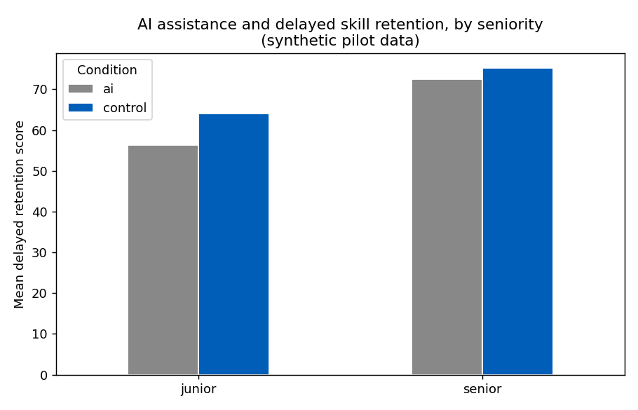

# AI & Skill Formation in Public-Sector Knowledge Work — Synthetic Pilot

A small, reproducible pilot that demonstrates the method behind a proposed empirical study:

> When public-sector knowledge workers use AI assistance, what happens to immediate output quality, speed, and delayed skill (retention) — and does it differ by seniority?

> ⚠️ The data here is simulated, not collected from real participants. The purpose is to show the full analysis pipeline — randomised design → treatment-effect estimation → heterogeneity analysis → honest write-up — end to end, so the research idea is demonstrably runnable. Planted effects mirror prior findings (AI tends to help speed and immediate quality while potentially reducing delayed skill formation, more so for less-experienced workers); the analysis recovers them with standard methods.

## Design

A simulated randomised experiment (N = 400): each "participant" is randomised to AI-assisted vs control, with balanced seniority (junior/senior). Three outcomes per participant:

| Outcome | Meaning |
|---|---|
| quality_score | Blind-rated quality of the immediate, assisted task (0–100) |
| time_mins | Time to complete the immediate task |
| retention_score | Quality on a later, unassisted task — the skill-formation measure |

## Headline results (from simulate_and_analyse.py, seed = 42)

| Outcome | AI − Control | 95% CI | p |
|---|---|---|---|
| Immediate quality | +4.46 | [+2.64, +6.29] | < 0.001 |
| Time on task (mins) | −7.97 (faster) | [−9.18, −6.76] | < 0.001 |
| Delayed retention | −5.14 | [−7.45, −2.84] | < 0.001 |

**Heterogeneity (OLS, retention_score ~ ai * senior):**

- AI effect on retention for juniors: −7.77 (p < 0.001)
- Interaction ai × senior: +5.13 (p = 0.007) → the retention penalty is concentrated among junior workers; seniors are largely protected.



Read in plain English: in this synthetic pilot, AI assistance made people faster and lifted immediate quality, but lowered how well they performed later without the tool — and that downside fell mainly on junior workers. If this pattern held in real public-sector settings, it would have direct implications for how institutions sequence AI rollout, training and supervision.

## What this would look like with real data (next steps)

- Recruit real knowledge workers; replace simulated outcomes with blind-rated task performance.
- Pre-register hypotheses and the analysis plan.
- Add robustness checks (covariate adjustment, multiple-comparison correction) and report null results honestly.
- Triangulate with observational data on AI adoption and productivity across occupations.

## Limitations

- Synthetic data — results are illustrative of the method, not empirical findings.
- Effects are planted; real effects may be smaller, absent, or in the other direction.
- Single-session design; real skill formation unfolds over longer horizons.

## Run it

```bash
pip install -r requirements.txt
python simulate_and_analyse.py
```

Outputs: data_synthetic.csv, console statistics, and retention_by_group.png.

## Stack

Python · NumPy · pandas · statsmodels · SciPy · Matplotlib

---

Author: Yenlik Gaisina · methods pilot for empirical research on AI's societal & economic effects.
